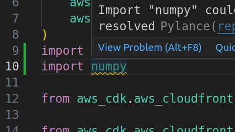

# Poetry

If you see something like this, it means that is not recognizing the packages


It could be two reasons:

1. The dependency is not in the **pyproject.toml**

2. If the dependency is present, then it should be caused due to Visual Code not finding the interpreter, meaning that it can not find the .env (where the dependencies are installed).
It's resolved here [Visual Studio Code does not detect Virtual Environments](https://stackoverflow.com/questions/66869413/visual-studio-code-does-not-detect-virtual-environments)
```
   In VSCode open your command  palette — Ctrl+Shift+P by default
    Look for Python:    
    Select Interpreter

    In Select Interpreter choose Enter interpreter path... and then Find...

    Navigate to your venv folder — eg, ~/pyenvs/myenv/ or \Users\Foo\Bar\PyEnvs\MyEnv\

    In the virtual environment folder choose <your-venv-name>/bin/python or <your-venv-name>/bin/python3
```
